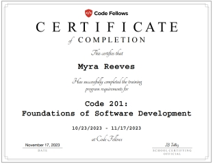

<!--
**MyraReeves/MyraReeves** is a ✨ _special_ ✨ repository because its `README.md` (this file) appears on your GitHub profile.

Here are some ideas to get you started:

- 🔭 I’m currently working on ...
- 🌱 I’m currently learning ...
- 👯 I’m looking to collaborate on ...
- 🤔 I’m looking for help with ...
- 💬 Ask me about ...
- 📫 How to reach me: ...
- 😄 Pronouns: ...
- ⚡ Fun fact: ...
-->

Hello everyone! My name is Myra.  It is spelled phonetically for American English.  As a result, one handy mnemonic is that it's as if you are saying "My [Egyptian sun god]!" 𓁛𓇳 🌞

 

 

&nbsp;

  

### Experience Using:

 
 
 
 
  
 
 
  
  

 

&nbsp;

### **<ins>Where I'm From</ins>:**

🌎 I have lived in several locales during my life, including having been a [Zonian](https://www.relofirm.com/blog/what-is-a-zonian-navigating-the-cultural-crossroads-of-the-canal-zone/) when I was a young child.  We immigrated from a small, rural town (Gamboa) to the United States in mid-1989 in direct response to the violence that erupted from Manuel Noriega's successful autocoup when he refused to accept Panama's presidential election results.

I currently live in the southeastern farmland of the Puget Sound Area of Washington state (Pierce County).

🐾 I am transitioning into the tech world from a unique previous career!  Starting as a teenager, I spent decades working professionally with wild animals, in a variety of field and zoological settings.  The work involved a huge range of species (and even a few domesticated animals!) but the ones I ended up working the most with were marine mammals and birds of prey.

🚌 In December 2017, however, life circumstances forced me into a job in public transportation. My personal experience of the height of the COVID-19 pandemic was driving buses thru the eerily deserted streets of downtown Seattle, similar to what was shown in [the Rolling Stones music video](https://www.youtube.com/watch?v=LNNPNweSbp8). During my time as a transit operator, I personally transported tech workers on a variety of bus routes within King County.  It is appealing to imagine being on the other side of that scenario soon in my future!  I am excited about this life change to a career in tech!  As a lifelong learner and adventurer, I have always been interested in the diversity aspects of technology, as well as the language aspect of coding.  As a coding student, I have been finding that my perseverance and adaptability skills are well-suited to the task.  As the child of an artist, I have also always appreciated the creativity and innovation that technology fosters!

### **<ins>Hobbies</ins>:**

⚔️  In addition to a love of animals and artistic endeavors, the hobby I am most passionate about is HEMA.  I am a scholar level student in [The 1595. Club](https://www.the1595club.com/) historical fencing group, currently learning directly from the founder (Chris Chatfield) via Zoom but with occassional in-person learning from the Washington chapter inside of [Lonin League](https://www.lonin.org/) in Seattle.  In 2023, I also joined the [Society for Creative Anachronism (SCA)](https://www.sca.org/new-to-the-sca/) and have been participating in their archery practices with a recurve bow. Lastly of note amongst my hobbies, I enjoy playing D&D with groups in Tacoma and Gig Harbor.

 

It is a pleasure to meet you!  I hope you enjoy looking thru my GitHub portfolio of my coding journey!

## 👩🏼‍💻                       
